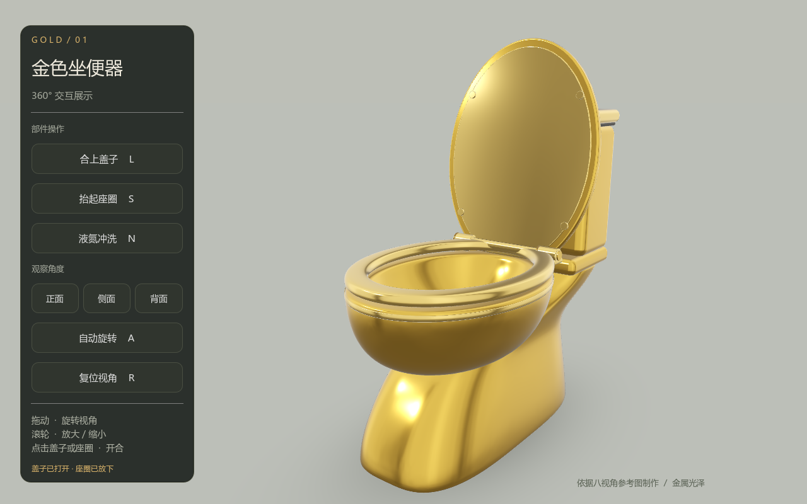
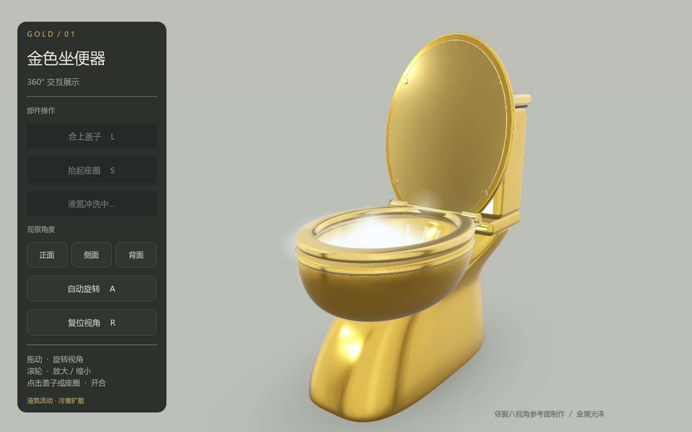

# Golden Toilet · 金色坐便器

使用 Blender 建模、Godot 制作的 3D 交互展示。支持旋转、缩放、盖子和座圈开合，以及液氮冲洗视觉特效。



## 功能与操作

| 操作 | 功能 |
| --- | --- |
| 左键拖动 | 旋转观察 |
| 滚轮 | 放大、缩小 |
| 点击盖子 / 座圈，或 L / S | 开合对应部件 |
| 点击水箱按钮，或 N | 播放液氮冲洗 |
| A | 自动旋转 |
| R | 复位视角 |

液氮冲洗约持续 5 秒，包含冷色液流、涟漪和白雾。冲洗时盖子、座圈保持触发瞬间的位置，正在开合的部件也会停住；自动旋转暂停，结束后恢复。连续点击不会叠加特效。

正常开合仍保留联动：抬起座圈会打开盖子，合上盖子会放下座圈。



## 运行

已验证环境：Godot 4.3、Blender 5.2.1、Windows、OpenGL 兼容渲染器。

1. 安装 Godot 4.3。
2. 在项目管理器中导入 `godot/project.godot`。
3. 等待模型和 HDR 自动导入，按 F5 运行。

命令行也可运行；下文中的 `godot` 指本机 Godot 可执行文件：

```sh
godot --headless --editor --path godot --import
godot --path godot
```

Windows 可双击 `launch_viewer.cmd`。如果 Godot 不在 PATH 中，先在命令提示符中指定它的实际路径：

```bat
set "GODOT_BIN=C:\Tools\Godot\Godot.exe"
launch_viewer.cmd
```

`open_godot_editor.cmd` 打开工程；`open_blender.cmd` 打开模型。Blender 不在 PATH 中时，可用相同方式设置 `BLENDER_BIN`，或者直接用 Blender 打开 `.blend` 文件。

界面通过系统字体显示中文：优先使用微软雅黑或 Noto Sans CJK SC。仓库不包含系统字体或引擎安装文件。

## 项目结构

```text
golden_toilet.blend          Blender 源文件，贴图已内嵌
build_model.py              程序化建模与 GLB 导出脚本
godot/
  project.godot             Godot 项目配置
  main.tscn                展示入口
  viewer.gd                相机、界面及部件控制
  nitrogen_effect.gd       液流、冷雾和涟漪
  studio_floor.gdshader    摄影棚地面
  assets/                  GLB 模型及 HDR 灯光
  tests/                   交互与冲洗静止检查
docs/ASSETS.md              素材来源
```

Godot 缓存、编辑器配置、日志和 Blender 备份由 `.gitignore` 排除。资产导入配置 `*.import` 保留在仓库中，首次运行时自动生成缓存。

## 检查与重新生成

先完成 Godot 资产导入，再执行：

```sh
godot --path godot --script res://tests/check_interaction.gd
godot --path godot --script res://tests/check_flush_seat.gd
godot --path godot --script res://tests/capture_preview.gd
```

前两项检查部件开合、缩放、重复冲洗、特效清理，以及在抬起、放下、正在运动三种状态下保持盖子和座圈位置。第三项重新生成展示截图。

需要重新生成模型时：

```sh
blender --background --python-exit-code 1 --python build_model.py
```

该命令会覆盖模型、GLB、HDR 和离线预览；手动修改过 Blender 源文件时，请先保留副本。

## 上传 GitHub

解压后，把此文件夹中的内容放在仓库根目录。使用 GitHub Desktop 添加这个文件夹并发布仓库，或者在新仓库中按 GitHub 显示的 Git 命令提交和推送。

本次打包未附开源许可证；可以在发布前选择并添加 `LICENSE`。

## 制作说明

模型参考八张多视角图片估算比例，未标定真实尺寸。液氮冲洗是视觉特效，实时反射与 Blender 离线渲染存在差异。
